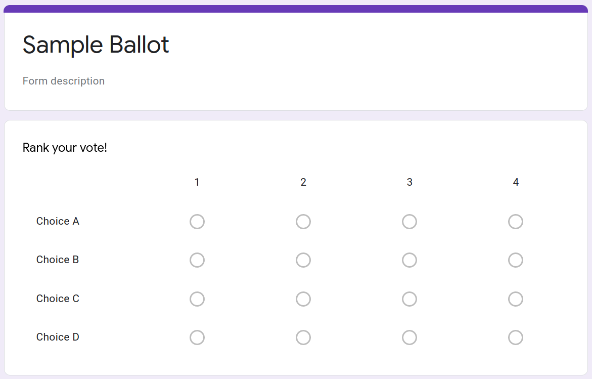

# climbvote

Hello intrepid climber and/or internet navigator! This repository houses `climbvote`, a script to count votes cast on a ranked-choice ballot. This code was written to count votes for some multi-winner races in club elections for the Yale Climbing Team and Outdoor Climbing Club, but it could be used in many contexts and adapted to many more. The `pyrankvote` library does the heavy lifting, we count with "multi-winner ranked choice voting" AKA Single Transferrable Vote, and the input format is assumed to be a CSV as given by Google Forms.

Here is a little bit to get you going. Tested on Python 3.8.2.

## Setup

Use pip to install required libraries (classic ones: numpy, pandas; and pyrankvote):

```
pip install -r requirements.txt
```

## Data

The files `votes_food.csv`, `votes_aceg*.csv` hold some phony votes for some phony candidates. They were downloaded from simple Google Forms that make the ballot out of a multiple choice grid. The key assumptions that `climbvote` makes for its input data are that:
* The first column of the CSV is unecessary (timestamps); and
* Candidate names are given in the subequent columns, surrounded by brackets, e.g. [Name].

See below for an example ballot template with Google Forms. Consider setting "Limit to one response per column" for validation.



## Running elections

Here's a helpful help printout:
```
usage: climbvote.py [-h] [--output OUTPUT] <csv file> <# seats>

Counts a ranked-choice voting election with potentially multiple winners using Single Transferrable Vote. Prints the count to stdout and saves to file.

positional arguments:
  <csv file>       Path to a CSV file of all the votes (formatted like votes.csv)
  <# seats>        Number of open seats to win

optional arguments:
  -h, --help       show this help message and exit
  --output OUTPUT  Name of file to write output. Default is current date and time.
```

For example, to name the top-two foods:
```
$ python climbvote.py data/votes_food.csv 2
FINAL RESULT
Candidate      Votes  Status
-----------  -------  --------
Apples             4  Elected
Cantelope          4  Elected
Bananas            0  Rejected
Donuts             0  Rejected

Saved to file 20200423_164709.out
```

Alternatively, run the food election with three seats:
```
$ python climbvote.py data/votes_food.csv 3
ROUND 1
Candidate      Votes  Status
-----------  -------  --------
Apples             4  Elected
Cantelope          4  Elected
Bananas            0  Hopeful
Donuts             0  Hopeful

FINAL RESULT
Candidate      Votes  Status
-----------  -------  --------
Apples             2  Elected
Cantelope          2  Elected
Bananas            3  Elected
Donuts             1  Rejected

Saved to file 20200423_164805.out
```

## More info

We found ranked-choice voting through Single Transferrable Vote desirable for multi-winner elections in order to avoid having to make possibly arbitrary tiebreak decisions. It's also desirable for encouraging voters to put more thought into each candidate and for more fairly reflecting voters' preferences. However, it's also complex, and if presented wrongly might provoke voters' distrust. For more reading on how the algorithm works:

* [Wikipedia article on STV](https://en.wikipedia.org/wiki/Single_transferable_vote)
* [Example walking through the counting steps in a mock election](https://www.rankedchoicevoting.org/how_multi_seat_rcv_works)
* [PyRankVote library](https://github.com/jontingvold/pyrankvote). Also note that `pyrankvote` can instead count with Instant Runoff and Preferential Block voting, and changing it in this script would amount to changing one line of code.
